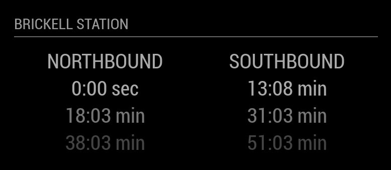

# mmm-miami-transit
The MagicMirror Miami transit module (`mmm-miami-transit`) displays the Miami 
Metrorail times for a given train station.





## Installation
- Clone the module from github: 
    - `git clone https://github.com/istvanfedak/mmm-miami-transit 
       ~/MagicMirror/modules/mmm-miami-transit`
- Navigate to the mmm-miami-transit folder and install the module's 
  dependencies: 
    - `cd ~/MagicMirror/modules/mmm-miami-transit && npm install`
- Rebuild node dependencies to be compatible with Electron
    - Rebuild dependencies: `$(npm bin)/electron-rebuild`
- Add your brand new module to your config!
    - Open the configuration file: `nano ~/MagicMirror/config/config.js`
    - Add the mmm-miami-transit module to the modules array:
    ```
    {
        module: 'mmm-miami-transit',
        position: 'top_left',
        config: {
            stationId: 'BLK'
        }
    }
    ```
    - Edit stationId (default is Brickell)
        - Go to http://www.miamidade.gov/transit/WebServices/TrainStations
          and find your station's stationId
    - Save and close the file by typing: `Ctrl-o` and then `Ctrl-x`
